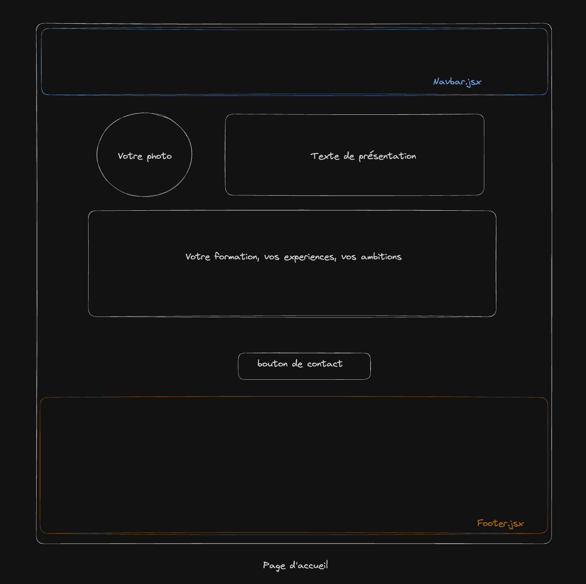
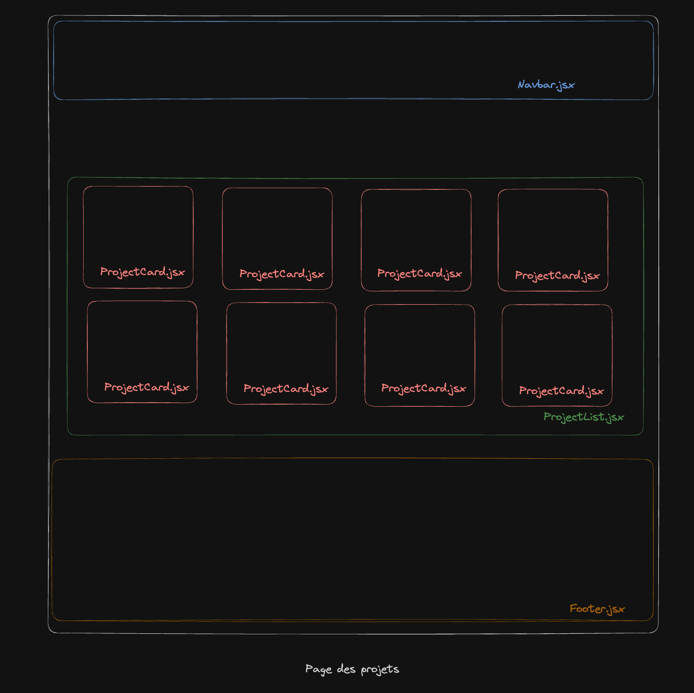
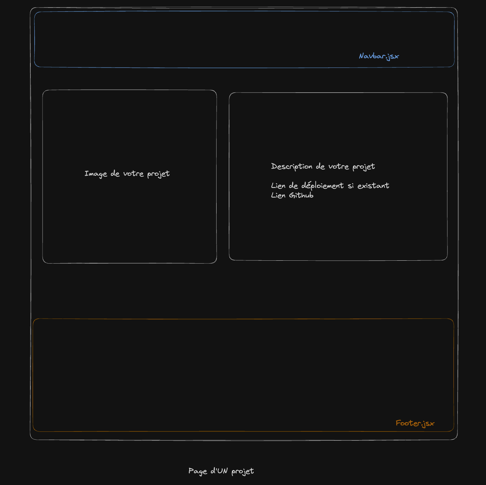
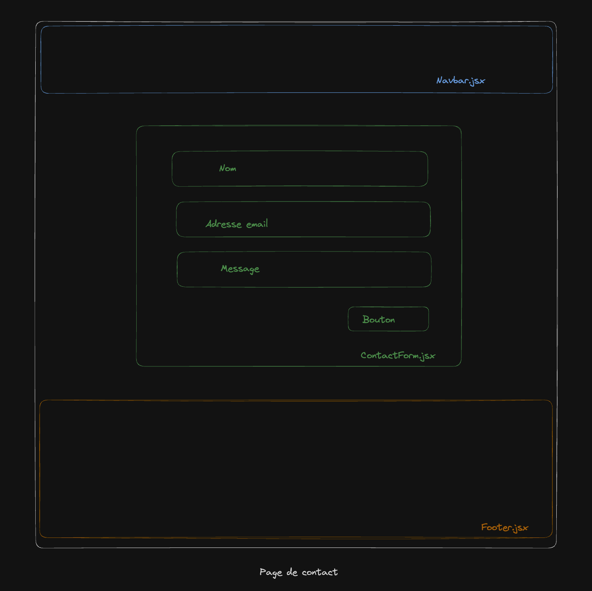

# Exercice: Création d'un Portfolio en React

## Objectif
Construire un portfolio simple avec React qui comprend trois pages : une page de présentation, une page de projets, et une page de contact. Cet exercice permettra de pratiquer l'utilisation de `react-router-dom`, les `props`, les `states`, et optionnellement les requêtes asynchrones avec `fetch`.

## Outils et technologies à utiliser
- React (Vite)
- React Router (pour la navigation entre les pages)
- CSS pour le style (ou autre framework CSS)

## Instructions détaillées

### 1. Configuration initiale
- Installez et initialisez un nouveau projet React avec Create React App.
- Installez `react-router-dom` pour gérer la navigation entre les pages.

  ```bash
  npm create vite react-portfolio
  cd portfolio
    ```

### 2. Structure du projet

Créez les dossiers et fichiers suivants :

`src/pages/` - Pour tous vos composants React.
- HomePage.jsx - Composant pour la page de présentation.
- ProjectsPage.jsx - Composant pour la page de projets.
- ProjectPage.jsx - Composant pour la page d'un projet.
- ContactPage.jsx - Composant pour la page de contact.

`src/components/` - Pour les composants réutilisables.
- Navbar.jsx - Composant pour la barre de navigation.
- Footer.jsx - Composant pour le pied de page.
- ProjectCard.jsx - Composant pour afficher un projet.
- ProjectList.jsx - Composant pour afficher une liste de projets.
- ContactForm.jsx - Composant pour le formulaire de contact.

### 3. Mise en place de la navigation

- Dans le composant `main.jsx`, importez les composants `CreateBrowserRouter` et `RouterProvider`. Mettez en place votre configuration de routes.
```js
import React from "react";
import ReactDOM from "react-dom/client";

import { createBrowserRouter, RouterProvider } from "react-router-dom";

const router = createBrowserRouter([
  {
    //... routes
  },
]);

const root = ReactDOM.createRoot(document.getElementById("root"));

root.render(
        <React.StrictMode>
          <RouterProvider router={router} />
        </React.StrictMode>
);
 
```

## 4. Pages

Les pages suivantes doivent être créées a minima avec le contenu proposé. Vous pouvez ajouter des éléments supplémentaires si vous le souhaitez.
Notez que les pages doivent être accessibles via la barre de navigation (Navbar).

Il est également important que les pages soient stylisées et responsive (s'adaptent à la taille de l'écran).

Toutes les pages doivent contenir une barre de navigation (Navbar) et un pied de page (Footer).

### Page d'accueil



La page d'accueil doit contenir les éléments suivants :
- Un titre principal.
- Une courte description de vous-même.
- Une image de profil (ou avatar).
- Une description de vos compétences.
- Un bouton pour accéder à la page de contact.

### Page de projets



La page de projets doit contenir les éléments suivants :
- Un titre principal.
- Une liste de projets (ProjectList) avec des informations de base (titre, description, image, lien).
- Un bouton pour accéder à la page de contact.

### Page d'un projet



La page d'un projet doit contenir les éléments suivants :
- Un titre principal.
- Une image du projet.
- Une description détaillée du projet.
- Un lien vers le projet (site web, dépôt GitHub, etc.).

### Page de contact



La page de contact doit contenir les éléments suivants :
- Un titre principal.
- Un formulaire de contact (ContactForm) avec les champs suivants : nom, email, message.
- Un bouton pour envoyer le formulaire.

### 5. Bonus

- Ajoutez des animations pour rendre votre portfolio plus interactif.
- Ajoutez des éléments (images, liens, etc.) provenant d'une API externe (par exemple, GitHub, Unsplash, etc.).
- Ajouter des éléments supplémentaires à vos pages (par exemple, un carrousel d'images, une carte Google Maps, etc.).
- Ajoutez une page de blog avec des articles.
- Mettez en place un formulaire de contact fonctionnel qui envoie les données à un serveur (Mailchimp, Brevo, etc.).

Amusez-vous bien !
